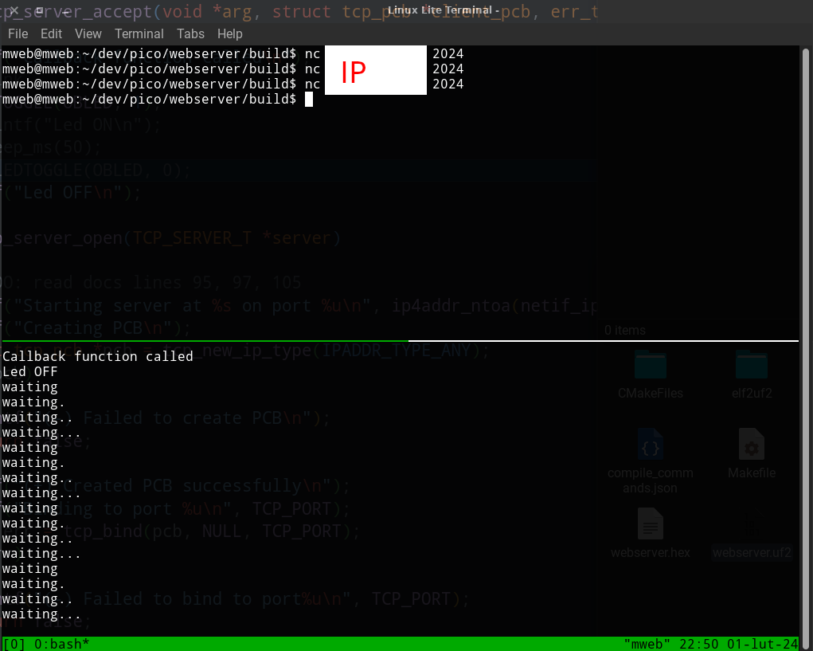
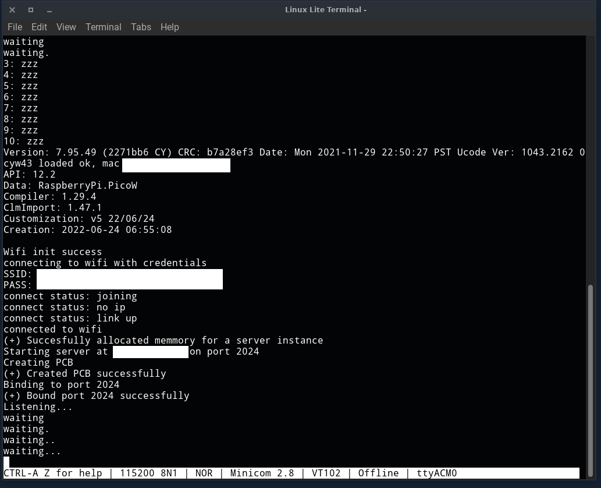

I suggest adding the following to your .bashrc:
```sh
export PICO_SDK_PATH="<PATH-TO-PICO-SDK>"

alias picocmake='cmake -DCMAKE_BUILD_TYPE=Debug -DPICO_BOARD=pico_w -DWIFI_SSID="<YOUR WIFI SSID>" -DWIFI_PASSWORD="<YOUR WIFI PASSWORD>"'
alias picominicom='minicom -b 115200 -o -D /dev/ttyACM0'
```


```sh
git clone https://github.com/rrekaF/pico-w-tcp-webserver
cd pico-w-tcp-websercer
mkdir build
cd build
picocmake ..
make
```

next load the uf2 file onto your rpi pico and connect with minicom
```sh
picominicom
```






